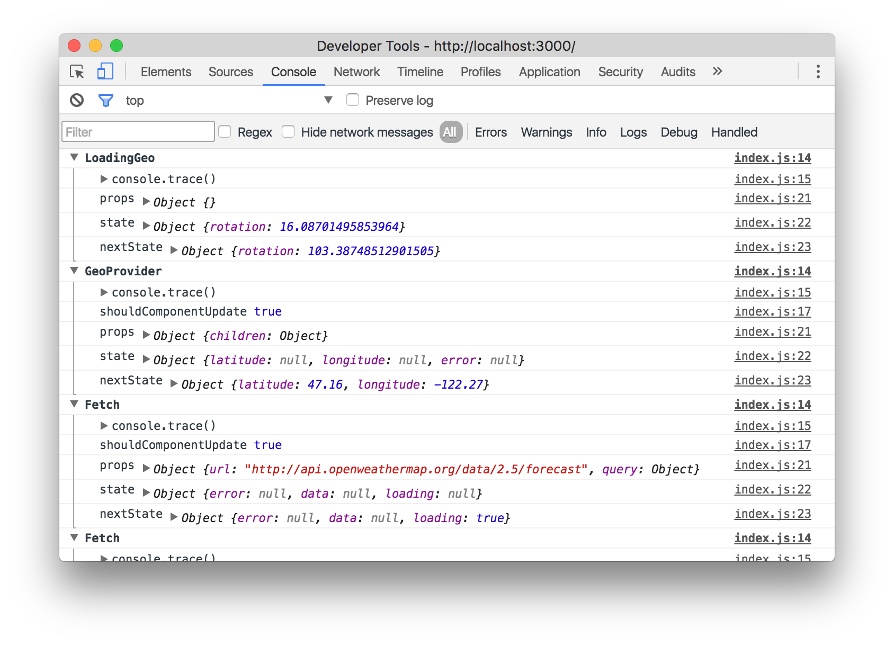

React Lumberjack
================

Logs `setState` calls across your app for debugging bliss.



Installation
------------

`npm install react-lumberjack`

Usage
-----

Just include it before you do any rendering with React.

```js
import 'react-lumberjack'
```

or

```js
require('react-lumberjack')
```

or

```xml
<script src="https://npmcdn.com/react-lumberjack@1.0.0"></script>
```

Make sure not to include it in your production build, ofc.

